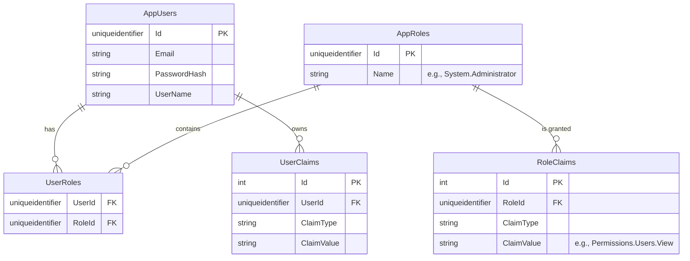

# 🗄️ Database Design

This document explains the database architecture used in the LegendsTeamVN.BadmintonClub system, including ERD diagrams, complex tables, and design rules.

*[Đọc bằng Tiếng Việt](DATABASE.VI.md)*

---

## 1. Multi-DbContext Architecture

The project uses **Entity Framework Core** but is divided into two separate database contexts (DbContexts) to ensure the **Separation of Concerns** principle:

1. **`AppIdentityDbContext`**: Manages all data related to users, authentication, authorization, and roles. Uses the `Identity` schema by default.
2. **`BadmintonDbContext`**: Manages all core business data of the badminton club (e.g., Courts, Bookings, Invoices, etc.). It is completely isolated from login logic.

*(These two DbContexts can be deployed on the same physical database using different Schemas, or split into separate Microservices later if required).*

---

## 2. Entity-Relationship Diagram (ERD) - Identity Module

Below is the extended user management schema based on the ASP.NET Core Identity core.

### Explanation of Complex Identity Tables:
- **`AppRoles` & `RoleClaims`**: The system applies a Claims-based Authorization model. Instead of hardcoding permissions into logic, each Role owns a list of `RoleClaims` that define permissions (e.g., `ClaimType = "Permission"`, `ClaimValue = "System.Administrator"`).
- **`UserRoles`**: A Join Table that maps the Many-to-Many (N-N) relationship between Users and Roles.

---

## 3. Database Rules

When designing a new business table (e.g., `Orders` or `Courts`), you must strictly adhere to the following principles:

1. **Primary Key**: Always use `uniqueidentifier` (`Guid` in C#) as the Primary Key to increase security, prevent data scraping, and easily support distributed architectures.
2. **Soft Delete**: Never execute hard `DELETE` commands on critical records (Invoices, Users). Use the `IsDeleted = true` flag (Soft Delete) combined with EF Core's Global Query Filters.
3. **Audit Trails**: Core data tables must inherit a base class containing audit fields:
   - `CreatedBy`
   - `CreatedOn`
   - `LastModifiedBy`
   - `LastModifiedOn`
4. **State Machine**: Complex lifecycle states (e.g., Booking Status: `Pending -> Confirmed -> Cancelled`) should be represented as an Enum combined with the **Smart Enum** pattern in C# rather than lifeless Integers in the DB. The Application layer will validate state transitions before saving to the DB.
