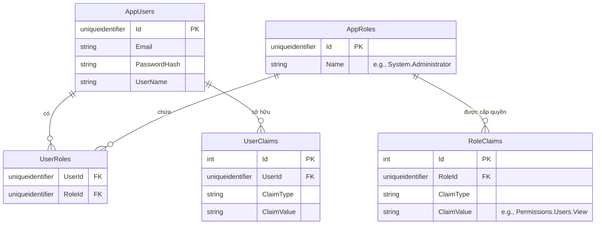

# 🗄️ Cấu trúc Cơ sở Dữ liệu (Database Design)

Tài liệu này giải thích cấu trúc Database đang được sử dụng trong hệ thống LegendsTeamVN.BadmintonClub, bao gồm sơ đồ ERD, các bảng dữ liệu phức tạp, và các quy tắc thiết kế (Database Rules).

*[Read this in English](DATABASE.md)*

---

## 1. Multi-DbContext Architecture

Dự án sử dụng **Entity Framework Core** nhưng được chia làm hai ngữ cảnh CSDL (DbContext) riêng biệt nhằm đảm bảo nguyên lý **Separation of Concerns**:

1. **`AppIdentityDbContext`**: Quản lý toàn bộ dữ liệu liên quan đến người dùng, xác thực (Authentication), phân quyền (Authorization) và cấu trúc Role. Sử dụng schema mặc định là `Identity`.
2. **`BadmintonDbContext`**: Quản lý toàn bộ dữ liệu nghiệp vụ lõi của câu lạc bộ (Ví dụ: Sân, Lịch đặt sân, Phiếu thu, v.v...). Tách biệt hoàn toàn khỏi logic đăng nhập.

*(Hai DbContext này có thể được triển khai trên cùng một Database vật lý thông qua các Schema khác nhau, hoặc tách ra thành Microservices sau này tùy nhu cầu mở rộng).*

---

## 2. Sơ đồ Thực thể - Liên kết (ERD) - Phân hệ Identity

Dưới đây là sơ đồ quản lý người dùng mở rộng dựa trên lõi ASP.NET Core Identity.

### Giải thích các Bảng Identity Phức tạp:
- **`AppRoles` & `RoleClaims`**: Hệ thống áp dụng mô hình phân quyền dựa trên Claims (Claims-based Authorization). Thay vì hardcode quyền vào logic, mỗi Role sẽ sở hữu danh sách các `RoleClaims` định nghĩa quyền hạn (Ví dụ: `ClaimType = "Permission"`, `ClaimValue = "System.Administrator"`).
- **`UserRoles`**: Bảng trung gian (Join Table) ánh xạ cấu trúc N-N giữa Người dùng và Vai trò.

---

## 3. Các Quy tắc Thiết kế Database (Database Rules)

Khi bạn thiết kế thêm một bảng nghiệp vụ mới (Ví dụ: Bảng `Orders` hoặc `Courts`), bắt buộc phải tuân thủ các nguyên tắc sau:

1. **Khóa Chính (Primary Key)**: Luôn sử dụng `uniqueidentifier` (`Guid` trong C#) làm Khóa chính để tăng tính bảo mật, chống cào dữ liệu (data scraping) và hỗ trợ tốt cho kiến trúc phân tán.
2. **Soft Delete**: Không bao giờ thực thi lệnh `DELETE` cứng các bản ghi quan trọng (Hóa đơn, User). Hãy sử dụng cờ `IsDeleted = true` (Soft Delete) kết hợp với Global Query Filters trong EF Core.
3. **Audit Trails**: Các bảng dữ liệu cốt lõi phải kế thừa base class chứa các trường kiểm toán:
   - `CreatedBy` (Ai tạo)
   - `CreatedOn` (Tạo lúc nào)
   - `LastModifiedBy` (Ai sửa cuối)
   - `LastModifiedOn` (Sửa lúc nào)
4. **State Machine (Trạng thái)**: Các trạng thái vòng đời phức tạp (ví dụ: Booking Status: `Pending -> Confirmed -> Cancelled`) nên được biểu diễn dưới dạng Enum kết hợp với pattern **Smart Enum** trong C# thay vì dùng các con số Int vô hồn trong DB. Lớp Application sẽ validate tính hợp lệ của việc chuyển đổi state trước khi lưu xuống DB.